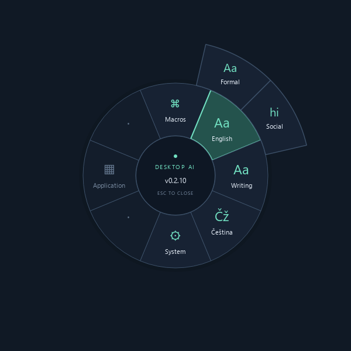
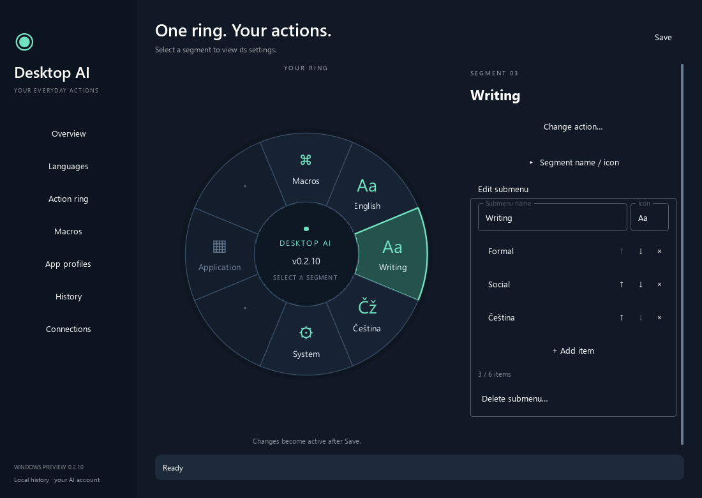
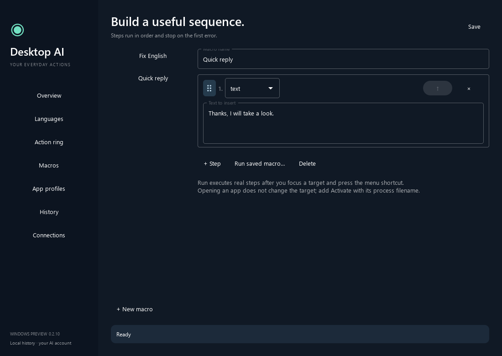

# Desktop AI Assistant

**A Windows action ring for editing text, running macros, and keeping useful actions close to the cursor.**

Select text in another app, open the ring, and choose an action. Correct English, switch between formal and casual writing, translate Czech into English, or fix Czech spelling. The result goes back to the original editor when the target is still safe to edit.



**Windows preview, source version 0.2.10.** Built with Python, PySide6 and Qt Quick. This repository provides source code; build instructions are below. Editor compatibility varies. Gmail still needs a full signed-in acceptance test.

## What it does

- **Text actions:** English Formal, English Social, and Czech correction through an installed Claude or Codex CLI.
- **A configurable ring:** eight fixed segments, custom labels and icons, nested submenus, and keyboard navigation.
- **Macros:** key combinations, text snippets, opening a file or URL, app activation, delays, and AI actions.
- **Application profiles:** keep the main ring stable while changing contextual actions for the focused app.
- **History and restore:** review saved results and restore original text when the target still matches.
- **Chrome and Edge extension:** Gmail compose editing with formatting markers and plain text fields on individually enabled HTTPS sites.



Screenshots use an isolated demo configuration, without personal editor contents, accounts, local paths, or conversation history.

## Try it from source

You need Windows, Python 3.14, and an installed, signed-in Claude or Codex CLI for AI actions. The project metadata accepts Python 3.12 through 3.14; the supplied lock was generated with Python 3.14 on Windows x64.

```powershell
git clone https://github.com/ludekvodicka/DesktopAiAssistant.git
cd DesktopAiAssistant
py -3.14 -m venv .venv
.venv/Scripts/python.exe -m pip install -r requirements.lock.txt
.venv/Scripts/python.exe -m pip install -e .
.\run.bat
```

Settings opens on startup. Choose your provider under **Languages** and use **Connections** to check the CLI and sign in. Closing Settings leaves the tray app running.

| Control | Default |
|---|---|
| Open or close the ring | `Ctrl+Alt+Space` |
| Stop an action | `Ctrl+Alt+Escape` |
| Reload source changes | **System → Restart app**, or **Restart app** in the tray |
| Exit | **Quit** in the tray |

Both shortcuts are configurable. A mouse button can trigger the ring by mapping it to the same shortcut in your mouse software.

1. Focus a supported editor and select text.
2. Open the ring and choose **English → Formal**, **English → Social**, or **Čeština**.
3. Keep the target unchanged while the action runs. Typing, clicking, scrolling, or changing focus can prevent automatic insertion.
4. If the result is held back, inspect it in **History**.

With no selection, a text action uses the whole focused field. AI actions never send Enter. Macro key steps can send Enter when explicitly configured.

## A few examples

| Task | Action |
|---|---|
| Polish a work message | Select the draft and choose **English → Formal**. |
| Write a casual reply | Choose **English → Social**; lowercase output is configurable. |
| Insert a prepared sentence | Create a **text** macro with your own snippet. |
| Group writing tools | Add a submenu in **Action ring**, then assign it to a segment. |

These are usage examples, not recorded AI outputs.



## Browser integration

Browser editing needs the native host and extension. Install Node.js 22 or later, then build the bundle:

```powershell
.\packaging\build.ps1
```

The output is `dist/DesktopAiAssistant`, including the desktop executable, `DesktopAiHost.exe`, and extension. Use the host from your own current build.

1. Start the desktop app. It prepares Native Messaging registration for the current Windows user.
2. Open `chrome://extensions` or `edge://extensions`, enable Developer mode, and load `dist/DesktopAiAssistant/browser-extension` as an unpacked extension.
3. On the website you want to edit, open the extension popup and choose **Enable this site**.
4. Confirm both **Access enabled** and **Desktop connected**. Permission and connectivity are separate checks.

Gmail supports compose bodies and subjects; recipient fields are refused. Other enabled HTTPS sites support plain `input` and `textarea` fields. General rich text outside Gmail is not supported.

After updating the extension, reload it and refresh the affected page. The [guide](docs/guide.md) describes formatting, restore, and known limits.

## Privacy and safety

**Selected text is sent to your chosen AI provider.** This is not an offline language model. The app invokes an installed CLI and never silently falls back to an API key.

Local data lives under `%LOCALAPPDATA%/DesktopAiAssistant`. History payloads and bridge credentials use Windows DPAPI for the current user. Settings and macro snippets are ordinary JSON; provider jobs can contain submitted text. Review settings exports before sharing them.

The app captures the target before an action and checks it again before writing. A changed editor, selection, or input state can retain the result in History instead of inserting it. Restore also checks the target and can refuse an unsafe replacement.

**Known limits:** Windows only; compatibility is not universal. Telegram Desktop, Gmail autosave/reopening, and accessibility need further hands-on verification. Elevated windows and general rich text outside Gmail are outside the supported scope.

## Development

```powershell
$env:QT_QPA_PLATFORM = 'offscreen'
.venv/Scripts/python.exe -m pytest tests/test_core.py tests/test_engine.py tests/test_bridge.py tests/test_browser_setup.py tests/test_ring_editor.py tests/test_settings_layout.py tests/test_clipboard.py tests/test_windows_worker.py -q
cd browser-extension
npm ci
npm run build
npm test
```

Additional tests open native windows, manipulate input or the clipboard, launch packaged executables, or call a live provider. Read [CONTRIBUTING.md](CONTRIBUTING.md) before running them.

## License

[MIT](LICENSE). Third-party dependencies retain their own licenses.
