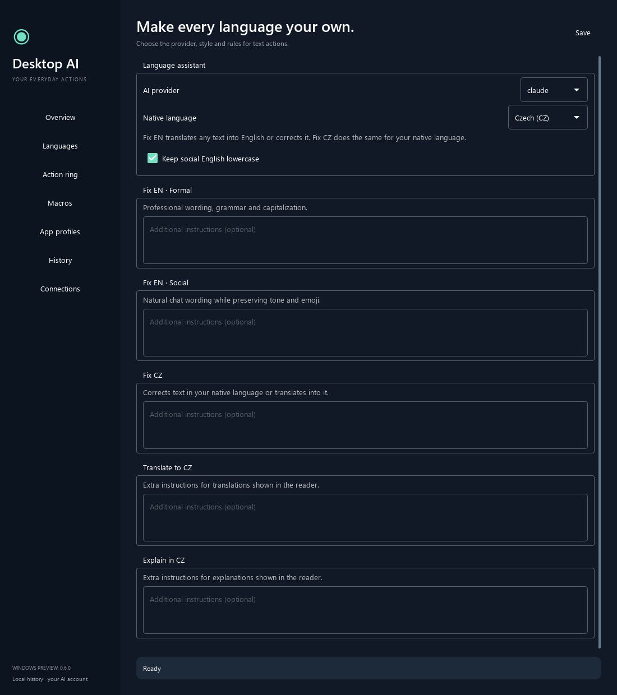

# Using Desktop AI Assistant

## Configure the ring

Open **System → Open config**. In **Action ring**, click a segment to select it, then choose **Change action**. The preview never executes an action. Save applies changes to the live ring.

Use **New submenu** to group up to six actions. Submenus may contain other submenus, up to eight levels deep. The app rejects circular references. Hover opens the first submenu; entering a nested group replaces the contents of the outer arc. The center's **Back** action returns to the preceding group.

## Language actions

**Languages** selects the provider, your native language, social lowercase output, and rules for each action. **Connections** checks the CLI and provides sign-in controls. Codex uses an app-specific login directory; Claude uses its existing CLI authentication.

**Fix EN → Formal** and **Fix EN → Social** correct English or translate any language into the corresponding English style. **Fix CZ** corrects text in your native language or translates into it, and keeps the original formality and form of address. Custom rules complement the built-in formatting and protected-literal checks.

A click on Formal, Social or Fix CZ edits the focused field through its adapter. Hover over the action to choose another source in the next ring: **Current app** copies the selection with Ctrl+C and pastes the result with Ctrl+V, for example in a browser without the extension; **Clipboard** fixes the text in the clipboard and puts the result back there. Both use plain text. Notepad++ is edited directly, also in the background.

The native language can be Czech (CZ, the default), Slovak, Polish, German, English, French, Spanish, Italian, Hungarian, or Ukrainian. The labels **Fix CZ**, **Translate to CZ**, and **Explain in CZ** use its short code. A language change shows in the editor previews at once and in the ring after Save, without a restart. A custom segment name keeps priority. Settings from earlier versions are migrated once on the first start; earlier versions cannot read the migrated file.

## Translate and explain

**Explain** contains **Translate to CZ** and **Explain in CZ**. Hover either branch to choose **Selection**, **Region**, or **Clipboard** in the next ring. A click on the branch opens those sources as a submenu. Groups take no shortcut; assign one to each source action under **App profiles → Direct action shortcuts**. Existing Translate groups become Explain on the first start; standalone Translate remains available in the action picker.

**Explain in CZ** directly explains the meaning, terms and relevant context of the source, including text already in Czech. For an image, it can also explain a diagram or other visible content. It opens the explanation in the reader with **Copy explanation**, **Show original**, **Retry**, and follow-up questions. Extra explanation instructions are configured under **Languages**.

- **Selection** reads the selected text in an editor, web page, or application. In a supported editor with no selection, it uses the whole field. When the editor adapters cannot read the content, the app sends Ctrl+C to the window in front, reads the copied formatted or plain text, and restores your previous clipboard if nothing else changed it. The copied selection can still appear in the Windows clipboard history (Win+V). Some applications copy the current line when nothing is selected. Terminals are refused, and elevated windows ignore the keys.
- **Region** freezes every screen. Drag a rectangle on one screen, holding **Ctrl** to move the whole rectangle without changing its size. Release Ctrl to resume resizing, and release the mouse to submit. The rectangle stays within that screen. Esc, a right click, the stop shortcut, or a very small drag cancels. The cropped image goes to the AI provider for translation or explanation; there is no local text recognition.
- **Clipboard** translates formatted text, plain text, or an image from the clipboard. Files and an empty clipboard are refused.

While the translation runs, the status popup in the bottom-right corner shows its progress and **Stop translation**, like a Fix action. The reader window opens when the translation is ready, sized to the text, and shows the translation with its headings, lists, tables, links, and code. **Copy translation** copies formatted text and a Markdown or plain-text version. **Show original** switches to the source or, for an image, the transcribed text. **Retry** sends the same source again. Under the translation you can type a question about the text and press **Ask** or Enter, or press **Explain** for the meaning, idioms, abbreviations and terms. Each answer is in your native language and knows the earlier questions, so you can ask follow-ups. Drag the handle between the translation and the conversation to change their heights. Questions and answers are saved with the translation in History. Esc closes the window. Closing the window during a run cancels it. Links open only when you click them, and only `http`, `https`, and `mailto` links. A warning appears when links or email addresses in the translation differ from the original.

Translation and explanation never write into the source application. They share one reader task, separate from Fix actions: either can run while a Fix runs or waits for its editor. A new translation or explanation replaces the running reader task. The stop shortcut and **Stop action** in the tray stop both. While a Fix action runs, the ring offers translation, explanation, Settings, and History. While the reader or Settings is in front, it offers only **Region**, **Clipboard**, and the System actions.

A translation can take up to three minutes; the result appears at once, not word by word. Text input is limited to 20,000 characters. Images are scaled to at most 2000 pixels on the long edge.

## Macros and application profiles

| Step | Behavior |
|---|---|
| `keys` | Send the explicitly configured key combination. |
| `text` | Insert a snippet or replace the selection. |
| `open` | Open a file, application, or HTTP(S) URL without evaluating a shell command. |
| `activate` | Focus a window by exact executable name; ambiguous matches are refused. |
| `delay` | Wait for the configured number of seconds. |
| `ai` | Run a language action. |
| `app` | Run an available built-in application command. |

An `open` step does not prove that a window is ready. Add explicit activation before subsequent input. Macros can partially complete before a later step fails. A key step can send Enter if you add it.

Profiles match exact executable filenames. New installations start with no profiles. The optional Jamat integration accepts a CLI wrapper path and project directory in Connections. Its reMarkable command is disabled because that integration is not implemented.

## History and restore

You can switch windows while an AI action runs. Native Windows Edit controls, writable UI Automation
fields, and plain browser fields can receive the result in the original field in the background.
The app compares the entire original content and target identity before writing. A different document,
closed editor, or changed text stops insertion and keeps the result in History.

Editors requiring a keyboard paste and formatted Gmail fields wait for you to return to the same
unchanged field. **Result ready** identifies this state; **Cancel insertion** or the stop shortcut
cancels the pending write while retaining the result. Only one Fix or macro action runs at a time,
including this waiting period; a translation can run alongside it. The app never brings the target window to the foreground for automatic insertion.

Direct UI Automation writes replace the field's plain text value. They can reset formatting and
the editor's native Undo. Use these desktop actions on plain text; original text remains available
through History. Text containing `<` waits for foreground insertion because some editors treat it
as HTML. Native Windows Edit and the browser adapter use their own addressed replacement paths.

History contains original text, results, status, and errors. Copying the original is available independently of restore. Translations appear with the status translated, failed, or cancelled; for an image, History keeps the transcribed text, never the image.

Select an applied result and choose **Restore**, focus the original editor, then press the ring shortcut. Restore requires a matching target and refuses when the document has changed. Browser navigation or a restarted app can invalidate the target.

## Gmail and browser fields

The extension keeps Gmail's original DOM structure locally and passes text with immutable formatting markers to the model. Links, attributes, images, signatures, and quoted regions are not accepted as arbitrary model-generated HTML. Invalid markers or altered protected literals cause rejection.

Enable sites individually. Plain text fields work on enabled HTTPS sites; rich text is limited to Gmail compose. When the extension is unavailable, Gmail does not fall back to a plain-text desktop paste.

Switching to another tab or window does not discard a plain-field result. The extension addresses the
saved tab and field, checking its document, URL, identity and full content. Gmail's formatted body
waits until that original field is focused again, then applies the originally captured range.
Navigating, closing, replacing or changing the source field stops insertion. After an update,
reload the unpacked extension and refresh the page.

## Updates

An installed copy checks GitHub releases on its own; **Check for updates** in the tray menu checks at once. A new version downloads in the background and is checked against the release's `SHA256SUMS.txt`. The tray shows one notice when it is ready, and the **Updates** group on **Overview** shows its release notes with **Restart and install** and **View on GitHub**. Without a click, the update installs on the next quit. Settings, history and the browser registration stay; reload the unpacked extension afterwards.

A copy run from source never updates itself.

## Storage and boundaries

The default data folder is `%LOCALAPPDATA%/DesktopAiAssistant`. Development and isolated tests can override it with `DESKTOP_AI_DATA`.

History payloads and bridge credentials use DPAPI for the current Windows user. This does not encrypt every file in the folder. Settings and macro snippets are ordinary JSON. Provider jobs can contain submitted text; leftover job folders are removed at startup. Protect this folder as personal data.

Text, clipboard content, and screen regions go to the selected AI provider only after you choose an action. The app takes no periodic screenshots. Region and clipboard images stay in memory and are never stored. Claude receives the image in its input stream; Codex receives a temporary image file in the job folder, deleted after the run.

History retention is configurable. Settings import is a preview until Save and never runs imported actions. Review exports for private snippets or paths before sharing.

## Verification limits

Native Windows Edit controls have integration coverage for selected text, whole-field replacement, stale content, and input guards. Other desktop editors use UI Automation or a clipboard path and need app-specific verification.

Gmail structure has DOM tests, but signed-in editing, autosave, and reopening a draft still need end-to-end acceptance. Test with a draft without recipients. Telegram Desktop is not claimed as verified. Image translation is verified with Claude only; Codex image input is not verified. Password fields, elevated targets, general rich text outside Gmail, and non-Windows platforms are outside the supported scope.
